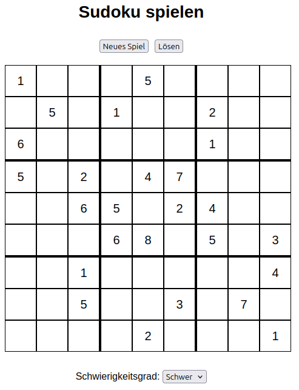

### JS-Code: Backtracking

```Javascript
    function isValid(board, row, col, num) {
        for (let i = 0; i < 9; i++) {
            if (board[row][i] === num || board[i][col] === num) {
                return false;
            }
        }
        let startRow = Math.floor(row / 3) * 3;
        let startCol = Math.floor(col / 3) * 3;
        for (let i = 0; i < 3; i++) {
            for (let j = 0; j < 3; j++) {
                if (board[startRow + i][startCol + j] === num) {
                    return false;
                }
            }
        }
        return true;
    }

    function solveSudoku(board) {
        for (let row = 0; row < 9; row++) {
            for (let col = 0; col < 9; col++) {
                if (board[row][col] === "_") {
                    for (let num = 1; num <= 9; num++) {
                        if (isValid(board, row, col, num)) {
                            board[row][col] = num;
                            if (solveSudoku(board)) return true;
                            board[row][col] = "_";
                        }
                    }
                    return false;
                }
            }
        }
        return board;
    }
```

https://de.wikipedia.org/wiki/Backtracking